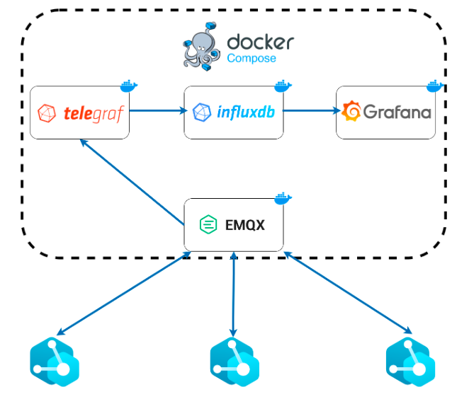

<!-- PROJECT LOGO -->
 

<h1 align="center">Arquitectura de red de sensores IoT con persistencia en influx DB</h1>
  

  

    En la actualidad, el Internet de las cosas (IoT) ha experimentado un auge significativo, impulsando la necesidad de soluciones eficientes para recopilar, almacenar y analizar grandes volúmenes de datos generados por sensores distribuidos en diferentes entornos. En este trabajo de investigación, se propone la implementación de un sensor IoT que enviará sus mediciones a través de tecnologías de bases de datos optimizadas para aplicaciones de IoT. El flujo de datos se gestionará mediante una instancia de Telegraph que publicará las mediciones de nuestro sensor en un broker MQTT utilizando EMQX. Posteriormente, otra instancia de Telegraph suscrita al broker escribirá los datos en una base de datos de serie de tiempo InfluxDB. Por último, los datos se visualizarán utilizando Grafana, y todo el sistema se desplegará y orquestará en un entorno Docker Compose.
     
    <a href="https://github.com/guille1093/iotDB"><strong>Explore el proyecto»</strong></a>
     
     
    <a href="https://github.com/guille1093/iotDB">Ver repo</a>
    ·
    <a href="https://github.com/guille1093/iotDB/issues">Reportar bug</a>
    ·
    <a href="https://github.com/guille1093/iotDB/issues">Solicitar PR</a>
  

## Introducción:

## Bases de Datos Optimizadas para Aplicaciones de IoT:
En el contexto de las aplicaciones de IoT, es fundamental contar con bases de datos optimizadas para manejar grandes volúmenes de datos en tiempo real y facilitar su análisis. 
Una base de datos de serie de tiempo (TSDB, por sus siglas en inglés) es una base de datos optimizada para datos con marca de tiempo o series de tiempo. Los datos de series de tiempo son simplemente mediciones o eventos que se rastrean, monitorean, muestrean y agregan a lo largo del tiempo. Esto puede incluir métricas de servidores, monitoreo del rendimiento de aplicaciones, datos de redes, datos de sensores, eventos, clics, transacciones en un mercado y muchos otros tipos de datos analíticos.
Una base de datos de serie de tiempo está diseñada específicamente para manejar métricas, eventos o mediciones con marca de tiempo. Una TSDB está optimizada para medir el cambio a lo largo del tiempo. Las propiedades que hacen que los datos de series de tiempo sean muy diferentes de otras cargas de trabajo de datos son la gestión del ciclo de vida de los datos, la sumarización y el escaneo de rangos amplios de muchos registros.

### ¿Qué es una TSDB?
En el contexto de las aplicaciones de IoT, es fundamental contar con bases de datos optimizadas para manejar grandes volúmenes de datos en tiempo real y facilitar su análisis. 
Una base de datos de serie de tiempo (TSDB, por sus siglas en inglés) es una base de datos optimizada para datos con marca de tiempo o series de tiempo. Los datos de series de tiempo son simplemente mediciones o eventos que se rastrean, monitorean, muestrean y agregan a lo largo del tiempo. Esto puede incluir métricas de servidores, monitoreo del rendimiento de aplicaciones, datos de redes, datos de sensores, eventos, clics, transacciones en un mercado y muchos otros tipos de datos analíticos.
Una base de datos de serie de tiempo está diseñada específicamente para manejar métricas, eventos o mediciones con marca de tiempo. Una TSDB está optimizada para medir el cambio a lo largo del tiempo. Las propiedades que hacen que los datos de series de tiempo sean muy diferentes de otras cargas de trabajo de datos son la gestión del ciclo de vida de los datos, la sumarización y el escaneo de rangos amplios de muchos registros.

### TSDBs en la actualidad
Las bases de datos de serie de tiempo no son nuevas, pero las bases de datos de serie de tiempo de primera generación se enfocaban principalmente en datos financieros, la volatilidad del comercio de acciones y sistemas construidos para resolver operaciones de trading. Sin embargo, los datos financieros son apenas una de las muchas aplicaciones de los datos de series de tiempo en la actualidad; de hecho, es solo una entre numerosas aplicaciones en diversas industrias. Las condiciones fundamentales de la informática han cambiado drásticamente en la última década. Todo se ha vuelto modular. Los mainframes monolíticos han desaparecido, reemplazados por servidores sin servidor, microservidores y contenedores.
Hoy en día, todo lo que puede ser un componente es un componente. Además, estamos presenciando la instrumentación de todas las superficies disponibles en el mundo material: calles, automóviles, fábricas, redes eléctricas, casquetes polares, satélites, ropa, teléfonos, microondas, recipientes de leche, planetas, cuerpos humanos. Todo tiene, o tendrá, un sensor. Por lo tanto, ahora todo dentro y fuera de estas empresas se emite un flujo incesante de métricas, eventos o datos de series de tiempo.
Esto significa que las plataformas subyacentes deben evolucionar para admitir estas nuevas cargas de trabajo: más puntos de datos, más fuentes de datos, más monitoreo, más controles. Lo que estamos presenciando y lo que demandan los tiempos es un cambio paradigmático en cómo abordamos nuestra infraestructura de datos y cómo construimos, monitoreamos, controlamos y administramos sistemas. Lo que necesitamos es una base de datos de serie de tiempo con rendimiento, escalabilidad y construcción específica para su propósito.

# Integración de Tecnologías:

## Sensor IoT: 
Se implementará un sensor IoT emulado capaz de generar y enviar mediciones en tiempo real. Este sensor estará conectado a través de la red para comunicarse con la instancia de Telegraph. 

## Telegraph: 
Se utilizarán dos instancias de Telegraph, una para recibir las mediciones enviadas por el sensor IoT y publicarlas en el broker MQTT. Otra instancia de telegraph que está suscrita al tópico correspondiente en el broker y envía las mediciones hacia la base de datos para su persistencia. Telegraph actuará como el intermediario para la transferencia de datos entre el sensor y la base de datos.

https://www.influxdata.com/time-series-platform/telegraf/

## Broker MQTT: 
EMQX se empleará como el broker MQTT para facilitar la comunicación bidireccional entre el sensor IoT y la instancia de Telegraph encargada de escribir los datos en InfluxDB. El broker MQTT garantiza la entrega confiable de mensajes en un entorno de IoT distribuido. Una de las ventajas de su utilización es que múltiples dispositivos pueden publicar o leer de los tópicos permitiendo una comunicación eficiente utilizando un patrón de diseño publicador / suscriptor en nuestra arquitectura.

https://www.emqx.io/

## InfluxDB: 
La base de datos InfluxDB se utilizará para almacenar y gestionar las mediciones provenientes del sensor IoT. Gracias a su estructura optimizada para datos de serie de tiempo, InfluxDB permite un almacenamiento eficiente y consultas ágiles sobre los datos capturados por el sensor.

https://www.influxdata.com/

## Grafana: 
Se empleará Grafana como herramienta de visualización para representar los datos almacenados en InfluxDB. Grafana permite crear paneles de control personalizados, gráficos interactivos y alertas basadas en los datos provenientes del sensor IoT.

https://grafana.com/

## Docker Compose: 
El entorno de Docker Compose se utilizará para orquestar y desplegar todas las tecnologías y componentes del sistema propuesto como servicios integrados dentro de una misma imagen. La utilización de contenedores facilita la replicación y escalabilidad del sistema en entornos de producción.

https://docs.docker.com/compose/
